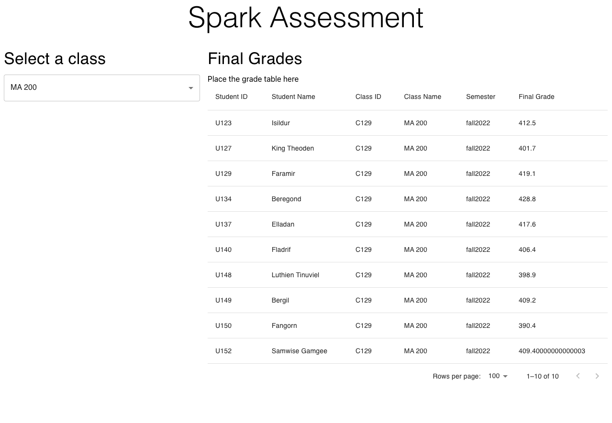
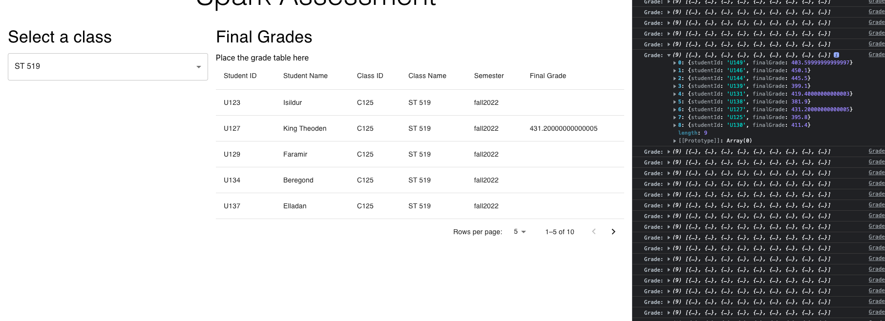

#  Spark! Software Engineering Assessment Sources:

https://stackoverflow.com/questions/58114855/handling-select-options-in-react-hooks \
https://mui.com/material-ui/react-select/

main sources are stackoverflow and documentation for react.

Latest Update: 4/12/2023 \
The "performace" problem resolved..... the issue is I forgot to comment out the method call in the App.tsx. So, it keeps making API call, which use up all the resouces and make a huge number of Calling to the API...

Alright, in the end, the program works find. 

My takeaway would just be you shouldn't doing the coding part when you are tired.
Take a snap! And things get a lot eaier.....

Update: 4/11/2023 \
The result website looks like the following:

But, I also encountered an performace problem since I call on the calculate_grade function. And it return the array of all the students'(in one class) final score.
After getting that back, I have to use the find function the match each student in the table.
So, it becomes incrediably slow. But, I was also to get the correct final score super fast. 
Mathcing take so much time!!!!!
And I try to use HashMap for storing and match afterward, the same error occurred. 
The proof is the following page, where I console.log() the final score get from the function calculate_grade:

